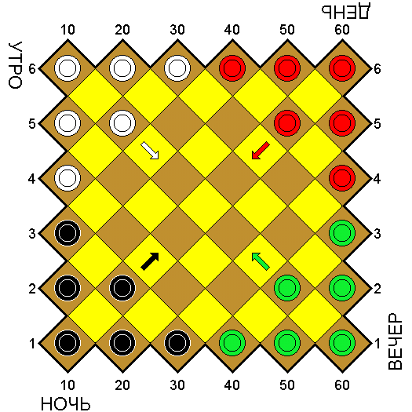
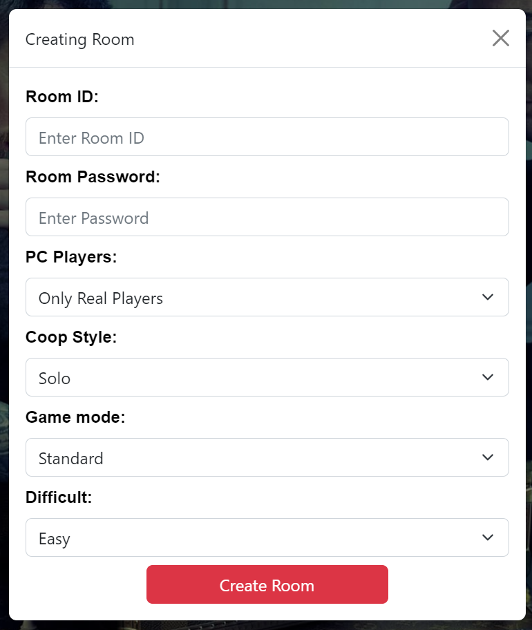
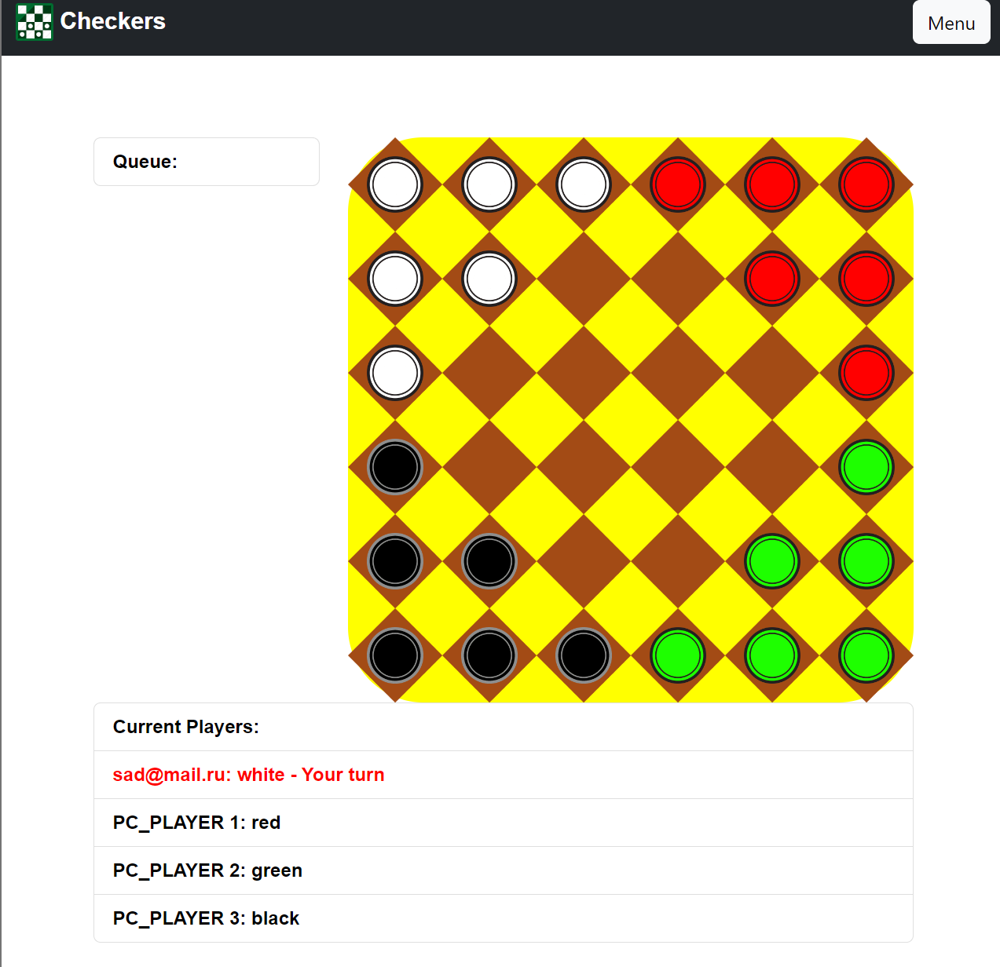

# Nevskie Shashki

**Nevskie Shashki** is a modern checkers variant from Russia, 
which was created by L. Lenisdat. It was first described in the book Igra, Igra! by N. N. Belov in 1987. 
It combines simplicity of rules with interesting multilateral strategies.

## Launch:

First of all, you need to deploy the database using docker.
Go to the `db` folder and run the command:

### `docker-compose up -d`

Now open the server folder and run the command to install the required libraries:

### `npm install`

After that, you need to start the server itself with the command:

### `npm start`

After the server is started, you need to go to the folder 
containing the client source code and run the previous two commands:

### `npm install`
### `npm start`

## First Launch

When you first start you need to create your account

After creating an account, you can enter existing rooms 

Or create your own

Once you join the room you can either watch others play while waiting for your turn or take part yourself

